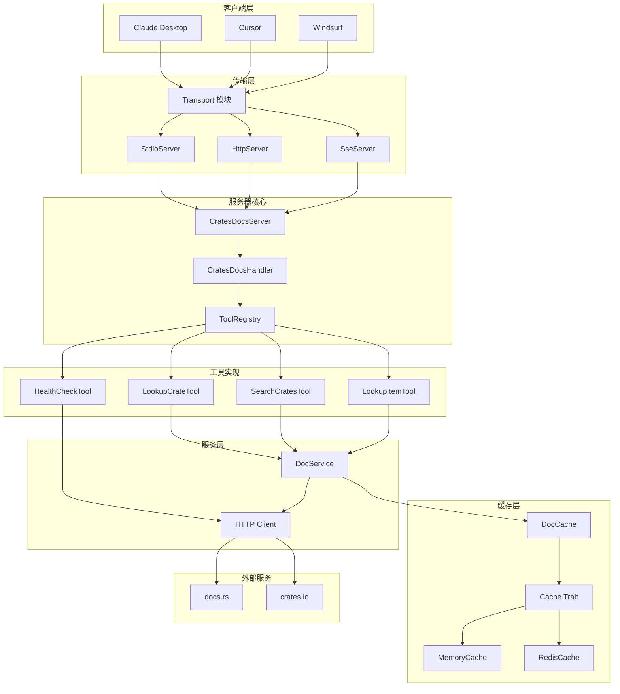
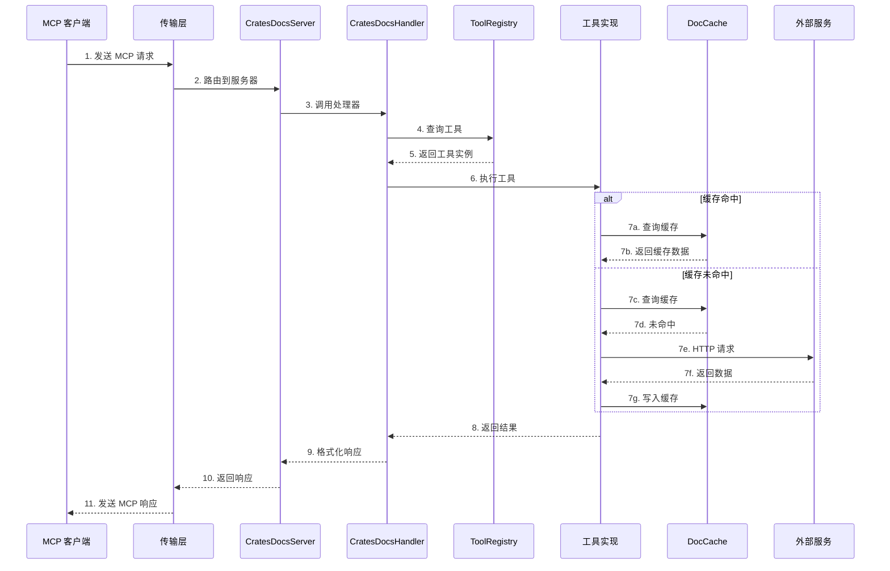
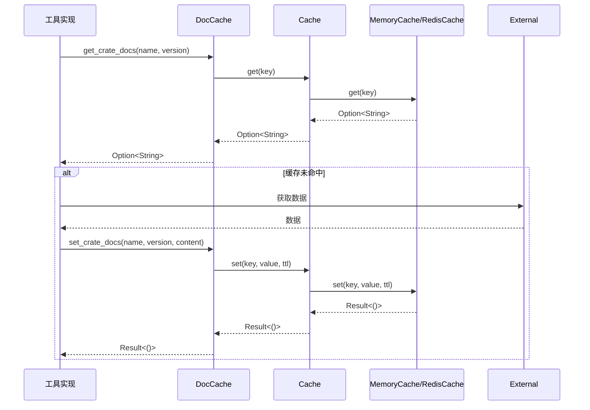

# Crates Docs MCP 服务器架构文档

本文档详细描述了 Crates Docs MCP 服务器的系统架构、模块职责和数据流。

## 目录

- [系统概述](#系统概述)
- [架构图](#架构图)
- [模块职责](#模块职责)
- [数据流](#数据流)
- [传输协议](#传输协议)
- [缓存策略](#缓存策略)
- [扩展指南](#扩展指南)

## 系统概述

Crates Docs MCP 服务器是一个高性能的 Rust crate 文档查询服务，基于 MCP（Model Context Protocol）协议实现。它支持多种传输协议（stdio、HTTP、SSE），提供 crate 搜索、文档查找和健康检查等功能。

### 核心特性

- **多协议支持**: Stdio、HTTP (Streamable HTTP)、SSE、Hybrid
- **高性能缓存**: 内存缓存（TinyLFU + TTL）和 Redis 缓存
- **模块化设计**: 清晰的模块划分，易于扩展和维护
- **完整文档**: 详细的 API 文档和使用示例

## 架构图

### 整体架构

```
┌─────────────────────────────────────────────────────────────────┐
│                        MCP 客户端层                              │
│  ┌──────────┐  ┌──────────┐  ┌──────────┐  ┌──────────┐        │
│  │  Claude  │  │  Cursor  │  │ Windsurf │  │  其他    │        │
│  └────┬─────┘  └────┬─────┘  └────┬─────┘  └────┬─────┘        │
└───────┼─────────────┼─────────────┼─────────────┼───────────────┘
        │             │             │             │
        └─────────────┴──────┬──────┴─────────────┘
                             │
┌────────────────────────────┼────────────────────────────────────┐
│                      传输层 │                                     │
│  ┌────────────┐  ┌─────────┴──┐  ┌────────────┐                  │
│  │   Stdio    │  │    HTTP    │  │    SSE     │                  │
│  │  传输模块  │  │  传输模块  │  │  传输模块  │                  │
│  └─────┬──────┘  └─────┬──────┘  └─────┬──────┘                  │
└────────┼───────────────┼───────────────┼─────────────────────────┘
         │               │               │
         └───────────────┴───────┬───────┘
                                 │
┌────────────────────────────────┼─────────────────────────────────┐
│                      服务器核心层 │                                 │
│                                 │                                 │
│  ┌──────────────────────────────┴──────────────────────────────┐ │
│  │                    CratesDocsServer                         │ │
│  │  ┌─────────────┐  ┌─────────────┐  ┌─────────────────────┐  │ │
│  │  │   Config    │  │   Cache     │  │   ToolRegistry      │  │ │
│  │  │   配置管理   │  │   缓存实例   │  │   工具注册表         │  │ │
│  │  └─────────────┘  └─────────────┘  └─────────────────────┘  │ │
│  └─────────────────────────────────────────────────────────────┘ │
│                                                                  │
│  ┌─────────────────────────────────────────────────────────────┐ │
│  │                  CratesDocsHandler                          │ │
│  │              MCP 请求处理器                                  │ │
│  └─────────────────────────────────────────────────────────────┘ │
└──────────────────────────────────────────────────────────────────┘
                                 │
         ┌───────────────────────┼───────────────────────┐
         │                       │                       │
┌────────┴────────┐    ┌────────┴────────┐    ┌────────┴────────┐
│     工具层       │    │     服务层       │    │     缓存层       │
│                 │    │                 │    │                 │
│ ┌─────────────┐ │    │ ┌─────────────┐ │    │ ┌─────────────┐ │
│ │lookup_crate │ │    │ │ DocService  │ │    │ │ MemoryCache │ │
│ └─────────────┘ │    │ └─────────────┘ │    │ └─────────────┘ │
│ ┌─────────────┐ │    │ ┌─────────────┐ │    │ ┌─────────────┐ │
│ │search_crates│ │    │ │ HttpClient  │ │    │ │ RedisCache  │ │
│ └─────────────┘ │    │ └─────────────┘ │    │ └─────────────┘ │
│ ┌─────────────┐ │    └─────────────────┘    │ ┌─────────────┐ │
│ │lookup_item  │ │                           │ │  DocCache   │ │
│ └─────────────┘ │                           │ └─────────────┘ │
│ ┌─────────────┐ │                           └─────────────────┘
│ │health_check │ │
│ └─────────────┘ │
└─────────────────┘
         │
         └───────────────────────────────────┐
                                             │
┌────────────────────────────────────────────┼────────────────────┐
│                      外部服务层             │                    │
│  ┌─────────────────────────────────────────┴─────────────────┐  │
│  │                      HTTP Client                           │  │
│  └───────────────────────────┬───────────────────────────────┘  │
│                              │                                  │
│  ┌─────────────────┐  ┌──────┴──────┐  ┌─────────────────┐     │
│  │    docs.rs      │  │  crates.io  │  │   其他服务       │     │
│  │  文档服务       │  │  包注册表    │  │                 │     │
│  └─────────────────┘  └─────────────┘  └─────────────────┘     │
└─────────────────────────────────────────────────────────────────┘
```

### 模块关系图



## 模块职责

### 1. 传输层 (`src/server/transport.rs`)

负责处理不同传输协议的连接和通信。

**职责：**
- 实现 Stdio、HTTP、SSE 传输协议
- 处理客户端连接和断开
- 协议数据的编码和解码
- 路由请求到处理器

**主要组件：**
- `run_stdio_server()`: 启动 Stdio 服务器
- `run_http_server()`: 启动 HTTP 服务器
- `run_sse_server()`: 启动 SSE 服务器
- `run_hybrid_server()`: 启动混合服务器
- `TransportMode`: 传输模式枚举

### 2. 服务器核心 (`src/server/mod.rs`)

MCP 服务器的核心实现，管理配置、工具和缓存。

**职责：**
- 服务器初始化和生命周期管理
- 配置管理
- 工具注册表管理
- 缓存实例管理

**主要组件：**
- `CratesDocsServer`: 主服务器结构体
- `server_info()`: 返回服务器元数据
- `run_stdio()`: 运行 Stdio 服务器
- `run_http()`: 运行 HTTP 服务器
- `run_sse()`: 运行 SSE 服务器

### 3. 请求处理器 (`src/server/handler.rs`)

处理 MCP 协议请求。

**职责：**
- 处理工具列表请求
- 处理工具调用请求
- 处理资源列表请求
- 处理提示列表请求

**主要组件：**
- `CratesDocsHandler`: 标准 MCP 处理器
- `CratesDocsHandlerCore`: 核心处理器（提供更细粒度的控制）

### 4. 工具层 (`src/tools/`)

实现 MCP 工具的具体功能。

**职责：**
- 实现工具 trait
- 处理工具参数解析
- 执行工具逻辑
- 返回工具结果

**主要组件：**
- `Tool` trait: 工具接口定义
- `ToolRegistry`: 工具注册表
- `LookupCrateToolImpl`: crate 文档查找
- `SearchCratesToolImpl`: crate 搜索
- `LookupItemToolImpl`: 项目文档查找
- `HealthCheckToolImpl`: 健康检查

### 5. 服务层 (`src/tools/docs/`)

提供文档查询的核心服务。

**职责：**
- HTTP 客户端管理
- 文档缓存管理
- 外部服务调用
- 数据解析和格式化

**主要组件：**
- `DocService`: 文档服务
- `DocCache`: 文档缓存
- `DocCacheTtl`: TTL 配置

### 6. 缓存层 (`src/cache/`)

提供高性能的缓存支持。

**职责：**
- 缓存数据的存储和检索
- TTL 过期管理
- 缓存清理
- 缓存统计

**主要组件：**
- `Cache` trait: 缓存接口
- `MemoryCache`: 内存缓存实现
- `RedisCache`: Redis 缓存实现
- `CacheConfig`: 缓存配置

### 7. 配置模块 (`src/config/`)

管理应用程序配置。

**职责：**
- 配置文件加载和解析
- 环境变量处理
- 配置验证
- 默认配置管理

**主要组件：**
- `AppConfig`: 应用配置
- `ServerConfig`: 服务器配置
- `CacheConfig`: 缓存配置
- `LoggingConfig`: 日志配置
- `PerformanceConfig`: 性能配置

### 8. 错误处理 (`src/error/`)

统一的错误处理机制。

**职责：**
- 定义错误类型
- 错误转换
- 错误信息格式化

**主要组件：**
- `Error`: 错误枚举
- `Result`: 结果类型别名

### 9. 工具函数 (`src/utils/`)

提供通用工具函数。

**职责：**
- HTTP 客户端构建
- 字符串处理
- 时间处理
- 验证函数

**主要组件：**
- `HttpClientBuilder`: HTTP 客户端构建器
- `RateLimiter`: 速率限制器
- `string`: 字符串工具
- `time`: 时间工具
- `validation`: 验证工具

## 数据流

### 工具调用数据流



### 缓存数据流



## 传输协议

### Stdio 模式

适合与本地 MCP 客户端集成，通过标准输入输出通信。

**特点：**
- 简单直接
- 无网络依赖
- 适合桌面客户端

**使用场景：**
- Claude Desktop
- Cursor
- Windsurf

### HTTP 模式

基于 Streamable HTTP 协议，支持无状态请求。

**特点：**
- 无状态设计
- 易于负载均衡
- 支持 HTTP/2

**端点：**
- `POST /mcp`: MCP 请求端点
- `GET /health`: 健康检查

### SSE 模式

基于 Server-Sent Events 协议，支持服务器推送。

**特点：**
- 服务器推送能力
- 实时更新
- 向后兼容

**端点：**
- `GET /sse`: SSE 连接端点

### Hybrid 模式

同时支持 HTTP 和 SSE 协议。

**特点：**
- 灵活性高
- 兼容性好
- 推荐用于网络服务

## 缓存策略

### 内存缓存

基于 `moka` 的高性能内存缓存。

**特点：**
- TinyLFU 淘汰策略
- 按条目 TTL 支持
- 线程安全
- 高性能

**配置：**
```toml
[cache]
cache_type = "memory"
memory_size = 1000
crate_docs_ttl_secs = 3600
item_docs_ttl_secs = 1800
search_results_ttl_secs = 300
```

### Redis 缓存

支持分布式部署的 Redis 缓存。

**特点：**
- 分布式支持
- 持久化能力
- 高可用性

**配置：**
```toml
[cache]
cache_type = "redis"
redis_url = "redis://localhost:6379"
key_prefix = "crates-docs"
```

### 缓存键格式

- Crate 文档: `crate:{name}` 或 `crate:{name}:{version}`
- 搜索结果: `search:{query}:{limit}`
- 项目文档: `item:{crate}:{path}` 或 `item:{crate}:{version}:{path}`

### TTL 策略

| 数据类型 | 默认 TTL | 说明 |
|---------|---------|------|
| Crate 文档 | 3600 秒 (1 小时) | 文档相对稳定 |
| 项目文档 | 1800 秒 (30 分钟) | 项目文档可能更新 |
| 搜索结果 | 300 秒 (5 分钟) | 搜索结果变化较快 |

## 扩展指南

### 添加新工具

1. 在 `src/tools/` 下创建新文件
2. 实现 `Tool` trait
3. 在 `create_default_registry()` 中注册工具

**示例：**

```rust
use crate::tools::Tool;
use async_trait::async_trait;
use rust_mcp_sdk::schema::{CallToolError, CallToolResult, Tool as McpTool};

pub struct MyToolImpl;

#[async_trait]
impl Tool for MyToolImpl {
    fn definition(&self) -> McpTool {
        McpTool {
            name: "my_tool".to_string(),
            description: Some("My tool description".to_string()),
            input_schema: serde_json::json!({
                "type": "object",
                "properties": {
                    "param": {
                        "type": "string",
                        "description": "Parameter description"
                    }
                }
            }),
            ..Default::default()
        }
    }

    async fn execute(
        &self,
        arguments: serde_json::Value,
    ) -> Result<CallToolResult, CallToolError> {
        // 实现工具逻辑
        Ok(CallToolResult::text_content(vec!["Result".into()]))
    }
}
```

### 添加新缓存实现

1. 在 `src/cache/` 下创建新文件
2. 实现 `Cache` trait
3. 在 `create_cache()` 中添加创建逻辑

**示例：**

```rust
use crate::cache::Cache;
use async_trait::async_trait;

pub struct MyCache {
    // 缓存实现
}

#[async_trait]
impl Cache for MyCache {
    async fn get(&self, key: &str) -> Option<String> {
        // 实现获取逻辑
    }

    async fn set(
        &self,
        key: String,
        value: String,
        ttl: Option<std::time::Duration>,
    ) -> crate::error::Result<()> {
        // 实现设置逻辑
        Ok(())
    }

    // 实现其他方法...
}
```

### 添加新传输协议

1. 在 `src/server/transport.rs` 中添加新函数
2. 在 `TransportMode` 枚举中添加新变体
3. 在 `run_server_with_mode()` 中添加路由逻辑

**示例：**

```rust
/// 运行 WebSocket 服务器
pub async fn run_websocket_server(server: &CratesDocsServer) -> Result<()> {
    // 实现 WebSocket 服务器
}

pub enum TransportMode {
    // ... 现有变体
    WebSocket,
}

pub async fn run_server_with_mode(
    server: &CratesDocsServer,
    mode: TransportMode,
) -> Result<()> {
    match mode {
        // ... 现有分支
        TransportMode::WebSocket => run_websocket_server(server).await,
    }
}
```

## 性能优化

### 缓存优化

- 合理设置 TTL，平衡数据新鲜度和缓存命中率
- 使用内存缓存减少网络延迟
- 对于分布式部署，使用 Redis 缓存

### HTTP 客户端优化

- 使用连接池复用连接
- 启用压缩减少传输数据量
- 合理设置超时时间

### 并发优化

- 使用异步编程模型
- 合理设置并发限制
- 使用速率限制防止过载

## 监控和日志

### 指标收集

- 请求数量和响应时间
- 缓存命中率和未命中率
- HTTP 请求统计
- 错误率统计

### 日志级别

- `trace`: 详细调试信息
- `debug`: 调试信息
- `info`: 一般信息
- `warn`: 警告信息
- `error`: 错误信息

## 安全考虑

### 认证

- 支持 OAuth 2.0 认证
- 可配置认证开关

### CORS

- 可配置允许的 Host 和 Origin
- 默认仅允许本地访问

### 速率限制

- 支持请求速率限制
- 支持并发请求限制

## 部署建议

### 单实例部署

适合小规模使用，使用内存缓存。

```toml
[cache]
cache_type = "memory"
memory_size = 1000
```

### 分布式部署

适合大规模使用，使用 Redis 缓存。

```toml
[cache]
cache_type = "redis"
redis_url = "redis://redis-cluster:6379"
key_prefix = "crates-docs-prod"
```

### Docker 部署

使用官方 Docker 镜像快速部署。

```bash
docker run -d \
  --name crates-docs \
  -p 8080:8080 \
  -v $(pwd)/config.toml:/app/config.toml:ro \
  kingingwang/crates-docs:latest
```

## 总结

Crates Docs MCP 服务器采用模块化设计，各层职责清晰，易于扩展和维护。通过合理配置缓存和传输协议，可以满足不同场景的需求。
