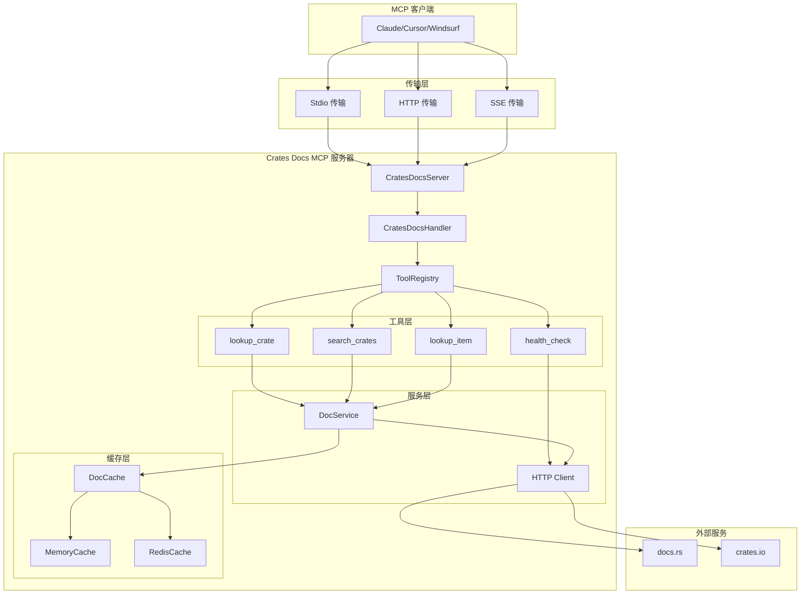
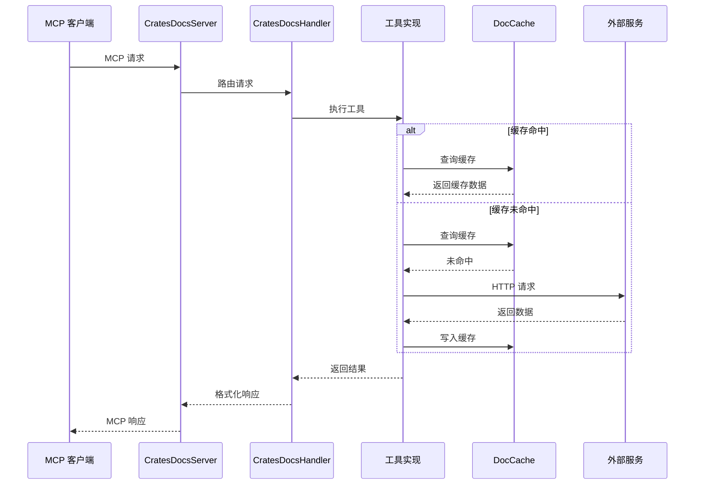

# Crates Docs MCP 服务器

[](https://crates.io/crates/crates-docs)
[](https://docs.rs/crates-docs)
[](https://hub.docker.com/r/kingingwang/crates-docs)
[](https://opensource.org/licenses/MIT)
[](https://github.com/KingingWang/crates-docs/actions)
[](https://codecov.io/gh/kingingwang/crates-docs)
[](https://github.com/KingingWang/crates-docs/stargazers)

一个高性能的 Rust crate 文档查询 MCP 服务器，支持多种传输协议。

## 特性

- 🚀 **高性能**: 异步 Rust + TinyLFU/TTL 内存缓存，支持按条目 TTL，可选 Redis 扩展
- 📦 **多架构 Docker 镜像**: 支持 `linux/amd64` 和 `linux/arm64`
- 🔧 **多种传输协议**: Stdio、HTTP (Streamable HTTP)、SSE、Hybrid
- 📚 **完整文档查询**: crate 搜索、文档查找、特定项目查询
- 🛡️ **安全可靠**: 速率限制、连接池、请求验证
- 📊 **健康监控**: 内置健康检查和性能监控
- 🏗️ **模块化架构**: 清晰的模块划分，易于扩展和维护
- 🔄 **HTTP 重试机制**: 可配置的 HTTP 客户端重试逻辑，提高外部服务调用可靠性
- 📊 **Prometheus 指标**: 内置指标监控支持，便于运维观测
- ⏱️ **细粒度缓存 TTL**: 为 crate 文档、项目文档、搜索结果提供独立的 TTL 配置

## 架构图

### 系统架构



### 数据流



## 项目结构

```
src/
├── lib.rs              # 库入口，导出公共 API
├── main.rs             # 程序入口
├── cache/              # 缓存层
│   ├── mod.rs          # Cache trait 定义
│   ├── memory.rs       # 内存缓存实现（TinyLFU + 按条目 TTL）
│   └── redis.rs        # Redis 缓存实现
├── cli/                # 命令行接口
│   ├── mod.rs          # CLI 定义和路由
│   ├── commands.rs     # 子命令定义
│   ├── serve_cmd.rs    # serve 命令实现
│   ├── test_cmd.rs     # test 命令实现
│   ├── config_cmd.rs   # config 命令实现
│   ├── health_cmd.rs   # health 命令实现
│   └── version_cmd.rs  # version 命令实现
├── config/             # 配置管理
│   └── mod.rs          # 配置结构和加载逻辑
├── error/              # 错误处理
│   └── mod.rs          # 错误类型定义
├── server/             # 服务器核心
│   ├── mod.rs          # 服务器定义
│   ├── auth.rs         # OAuth 认证
│   ├── handler.rs      # MCP 请求处理
│   └── transport.rs    # 传输层实现
├── tools/              # MCP 工具
│   ├── mod.rs          # 工具注册表
│   ├── health.rs       # 健康检查工具
│   └── docs/           # 文档查询工具
│       ├── mod.rs      # 文档服务
│       ├── cache.rs    # 文档缓存
│       ├── html.rs     # HTML 处理
│       ├── lookup_crate.rs  # crate 文档查找
│       ├── lookup_item.rs   # 项目文档查找
│       └── search.rs        # crate 搜索
└── utils/              # 工具函数
    └── mod.rs          # 通用工具
```

## 快速开始

### 使用 Docker（推荐）

```bash
# 从 Docker Hub 拉取镜像
docker pull kingingwang/crates-docs:latest

# 运行容器（官方镜像内置配置默认监听 0.0.0.0:8080）
docker run -d --name crates-docs -p 8080:8080 kingingwang/crates-docs:latest

# 使用自定义配置
docker run -d --name crates-docs -p 8080:8080 \
  -v $(pwd)/config.toml:/app/config.toml:ro \
  kingingwang/crates-docs:latest
```

### Docker Compose

```yaml
version: '3.8'
services:
  crates-docs:
    image: kingingwang/crates-docs:latest
    ports:
      - "8080:8080"
    environment:
      CRATES_DOCS_HOST: 0.0.0.0
      CRATES_DOCS_PORT: 8080
      CRATES_DOCS_TRANSPORT_MODE: hybrid
    volumes:
      - ./config.toml:/app/config.toml:ro
      - ./logs:/app/logs
    restart: unless-stopped
```

```bash
docker compose up -d
```

### 从源码构建

```bash
git clone https://github.com/KingingWang/crates-docs.git
cd crates-docs
cargo build --release
./target/release/crates-docs serve
```

### 从 crates.io 安装

```bash
cargo install crates-docs
crates-docs serve
```

## MCP 客户端集成

### Claude Desktop

编辑配置文件：
- **macOS**: `~/Library/Application Support/Claude/claude_desktop_config.json`
- **Windows**: `%APPDATA%\Claude\claude_desktop_config.json`
- **Linux**: `~/.config/Claude/claude_desktop_config.json`

```json
{
  "mcpServers": {
    "crates-docs": {
      "command": "/path/to/crates-docs",
      "args": ["serve", "--mode", "stdio"]
    }
  }
}
```

### Cursor

编辑 `~/.cursor/mcp.json`：

```json
{
  "mcpServers": {
    "crates-docs": {
      "command": "/path/to/crates-docs",
      "args": ["serve", "--mode", "stdio"]
    }
  }
}
```

### Windsurf

编辑 `~/.codeium/windsurf/mcp_config.json`：

```json
{
  "mcpServers": {
    "crates-docs": {
      "command": "/path/to/crates-docs",
      "args": ["serve", "--mode", "stdio"]
    }
  }
}
```

### Cherry Studio

1. 打开 Cherry Studio 设置
2. 找到 `MCP 服务器` 选项
3. 点击 `添加服务器`
4. 填写参数：

| 字段 | 值 |
|------|------|
| 名称 | `crates-docs` |
| 类型 | `STDIO` |
| 命令 | `/path/to/crates-docs` |
| 参数1 | `serve` |
| 参数2 | `--mode` |
| 参数3 | `stdio` |

5. 点击保存

> **注意**：将 `/path/to/crates-docs` 替换为实际的可执行文件路径。

### HTTP 模式

适合远程访问或网络服务：

```bash
crates-docs serve --mode hybrid --host 0.0.0.0 --port 8080
```

客户端配置：

```json
{
  "mcpServers": {
    "crates-docs": {
      "url": "http://your-server:8080/mcp"
    }
  }
}
```

## MCP 工具

### 1. lookup_crate - 查找 Crate 文档

从 docs.rs 获取完整文档。

| 参数 | 类型 | 必需 | 描述 |
|------|------|------|------|
| `crate_name` | string | ✅ | Crate 名称，如 `serde`、`tokio` |
| `version` | string | ❌ | 版本号，默认最新 |
| `format` | string | ❌ | 输出格式：`markdown`（默认）、`text`、`html` |

```json
{ "crate_name": "serde" }
{ "crate_name": "tokio", "version": "1.35.0" }
```

### 2. search_crates - 搜索 Crate

从 crates.io 搜索 Rust crate，支持按相关性、总下载量、近期下载热度、最近更新时间和最新发布进行排序，适合做 crate 发现、选型和横向比较。

| 参数 | 类型 | 必需 | 描述 |
|------|------|------|------|
| `query` | string | ✅ | 搜索关键词 |
| `limit` | number | ❌ | 结果数量（1-100），默认 10 |
| `sort` | string | ❌ | 排序方式，支持 `relevance`（默认）、`downloads`、`recent-downloads`、`recent-updates`、`new` |
| `format` | string | ❌ | 输出格式：`markdown`、`text`、`json` |

**排序建议**

- `relevance`：优先返回与关键词最相关的结果，适合通用搜索。
- `downloads`：按累计下载量排序，适合优先看生态里最常用、最成熟的 crate。
- `recent-downloads`：按近期下载热度排序，适合观察最近更活跃或更受关注的项目。
- `recent-updates`：按最近更新时间排序，适合关注仍在持续维护的 crate。
- `new`：按发布时间排序，适合探索新发布项目。

```json
{ "query": "web framework", "limit": 5, "sort": "downloads" }
{ "query": "mcp", "sort": "recent-downloads", "format": "json" }
```

### 3. lookup_item - 查找特定项目

查找 crate 中的特定类型、函数或模块。

| 参数 | 类型 | 必需 | 描述 |
|------|------|------|------|
| `crate_name` | string | ✅ | Crate 名称 |
| `item_path` | string | ✅ | 项目路径，如 `serde::Serialize` |
| `version` | string | ❌ | 版本号 |
| `format` | string | ❌ | 输出格式 |

```json
{ "crate_name": "serde", "item_path": "serde::Serialize" }
{ "crate_name": "tokio", "item_path": "tokio::runtime::Runtime" }
```

### 4. health_check - 健康检查

检查服务器和外部服务状态。

| 参数 | 类型 | 必需 | 描述 |
|------|------|------|------|
| `check_type` | string | ❌ | `all`、`external`、`internal`、`docs_rs`、`crates_io` |
| `verbose` | boolean | ❌ | 详细输出 |

```json
{ "check_type": "all", "verbose": true }
```

## 详细使用示例

### Stdio 模式

Stdio 模式适合与本地 MCP 客户端集成：

```bash
# 启动 Stdio 服务器
crates-docs serve --mode stdio

# 或使用默认配置（stdio 是某些客户端的默认模式）
crates-docs serve
```

**MCP 客户端配置示例：**

```json
{
  "mcpServers": {
    "crates-docs": {
      "command": "/usr/local/bin/crates-docs",
      "args": ["serve", "--mode", "stdio"]
    }
  }
}
```

### HTTP 模式

HTTP 模式适合远程访问或网络服务：

```bash
# 启动 HTTP 服务器
crates-docs serve --mode http --host 0.0.0.0 --port 8080

# 使用自定义配置
crates-docs serve --config config.toml
```

**使用 curl 测试 HTTP 端点：**

```bash
# 获取服务器信息（健康检查）
curl http://localhost:8080/health

# MCP 工具调用示例（需要 MCP 协议格式）
curl -X POST http://localhost:8080/mcp \
  -H "Content-Type: application/json" \
  -d '{
    "jsonrpc": "2.0",
    "id": 1,
    "method": "tools/list"
  }'
```

### SSE 模式

SSE 模式支持服务器推送：

```bash
# 启动 SSE 服务器
crates-docs serve --mode sse --host 0.0.0.0 --port 8080
```

**SSE 客户端连接：**

```bash
# 连接到 SSE 端点
curl http://localhost:8080/sse
```

### 工具调用示例

#### search_crates - 搜索 Crate

```bash
# 使用 CLI 测试工具
crates-docs test --tool search_crates --query "serde" --limit 5

# 预期输出：
# 搜索 "serde" 的结果：
# 1. serde (v1.0.xxx) - 序列化框架
#    下载量: xxx
#    描述: ...
```

**MCP 调用参数：**

```json
{
  "name": "search_crates",
  "arguments": {
    "query": "web framework",
    "limit": 10,
    "sort": "downloads",
    "format": "markdown"
  }
}
```

#### lookup_crate - 查找 Crate 文档

```bash
# 使用 CLI 测试工具
crates-docs test --tool lookup_crate --crate-name serde

# 指定版本
crates-docs test --tool lookup_crate --crate-name tokio --version "1.35.0"
```

**MCP 调用参数：**

```json
{
  "name": "lookup_crate",
  "arguments": {
    "crate_name": "serde",
    "version": "1.0.200",
    "format": "markdown"
  }
}
```

#### lookup_item - 查找特定项目

```bash
# 使用 CLI 测试工具
crates-docs test --tool lookup_item --crate-name serde --item-path "serde::Serialize"
```

**MCP 调用参数：**

```json
{
  "name": "lookup_item",
  "arguments": {
    "crate_name": "tokio",
    "item_path": "tokio::runtime::Runtime",
    "version": "1.35.0",
    "format": "markdown"
  }
}
```

#### health_check - 健康检查

```bash
# 使用 CLI 执行健康检查
crates-docs health --check-type all --verbose

# 仅检查外部服务
crates-docs health --check-type external
```

**MCP 调用参数：**

```json
{
  "name": "health_check",
  "arguments": {
    "check_type": "all",
    "verbose": true
  }
}
```

## 使用示例

### 了解新 crate

**用户**: "帮我了解一下 serde"

**AI 调用**: `{ "crate_name": "serde" }`

### 查找特定功能

**用户**: "tokio 怎么创建异步任务？"

**AI 调用**: `{ "crate_name": "tokio", "item_path": "tokio::spawn" }`

### 搜索相关 crate

**用户**: "有什么稳定、大家都常用的 HTTP 客户端？"

**AI 调用**: `{ "query": "http client", "limit": 10, "sort": "downloads" }`

## 命令行

```bash
# 启动服务器
crates-docs serve                          # 混合模式
crates-docs serve --mode stdio             # Stdio 模式
crates-docs serve --mode http --port 8080  # HTTP 模式

# 生成配置
crates-docs config --output config.toml
crates-docs config --output config.toml --force

# 测试工具
crates-docs test --tool lookup_crate --crate-name serde
crates-docs test --tool search_crates --query "async"
crates-docs test --tool search_crates --query "mcp" --sort downloads
crates-docs test --tool search_crates --query "agent" --sort recent-updates --format json

# CLI 健康检查入口
crates-docs health
crates-docs health --check-type external --verbose

# 版本信息
crates-docs version
```

> 全局参数见 [`Cli`](src/cli/mod.rs:27)，常用项包括 `--config`、`--debug`、`--verbose`。
>
> 当前 [`run_health_command()`](src/cli/health_cmd.rs:4) 仍是 CLI 级占位输出；需要真实探测 docs.rs / crates.io 状态时，应优先使用 MCP 工具 [`health_check`](src/tools/health.rs:11)。

## 配置

### 完整配置文件示例

下面是一个完整的配置文件示例，包含所有可用的配置项：

```toml
# 服务器配置
[server]
name = "crates-docs"                    # 服务器名称
version = "0.1.0"                       # 服务器版本
description = "Rust crate docs MCP server"  # 服务器描述
host = "0.0.0.0"                        # 监听地址（0.0.0.0 允许外部访问）
port = 8080                             # 监听端口
transport_mode = "hybrid"               # 传输模式：stdio/http/sse/hybrid
enable_sse = true                       # 启用 SSE 支持
enable_oauth = false                    # 启用 OAuth 认证
max_connections = 100                   # 最大并发连接数
request_timeout_secs = 30               # 请求超时（秒）
response_timeout_secs = 60              # 响应超时（秒）
allowed_hosts = ["localhost", "127.0.0.1"]    # 允许的 Host
allowed_origins = ["http://localhost:*"]      # 允许的 Origin

# 缓存配置
[cache]
cache_type = "memory"                   # 缓存类型：memory 或 redis
memory_size = 1000                      # 内存缓存大小（条目数）
redis_url = "redis://localhost:6379"    # Redis 连接 URL（使用 redis 时必需）
key_prefix = ""                         # 缓存键前缀
default_ttl = 3600                      # 默认 TTL（秒）
crate_docs_ttl_secs = 3600              # crate 文档缓存 TTL（秒）
item_docs_ttl_secs = 1800               # 项目文档缓存 TTL（秒）
search_results_ttl_secs = 300           # 搜索结果缓存 TTL（秒）

# 日志配置
[logging]
level = "info"                          # 日志级别：trace/debug/info/warn/error
file_path = "./logs/crates-docs.log"    # 日志文件路径
enable_console = true                   # 启用控制台日志
enable_file = false                     # 启用文件日志
max_file_size_mb = 100                  # 单个日志文件最大大小（MB）
max_files = 10                          # 保留的日志文件数量

# 性能配置
[performance]
http_client_pool_size = 10              # HTTP 客户端连接池大小
http_client_pool_idle_timeout_secs = 90 # 连接池空闲超时（秒）
http_client_connect_timeout_secs = 10   # 连接超时（秒）
http_client_timeout_secs = 30           # 请求超时（秒）
http_client_read_timeout_secs = 30      # 读取超时（秒）
http_client_max_retries = 3             # HTTP 客户端最大重试次数
http_client_retry_initial_delay_ms = 100    # 重试初始延迟（毫秒）
http_client_retry_max_delay_ms = 10000      # 重试最大延迟（毫秒）
cache_max_size = 1000                   # 最大缓存大小
cache_default_ttl_secs = 3600           # 默认缓存 TTL（秒）
rate_limit_per_second = 100             # 每秒请求速率限制
concurrent_request_limit = 50           # 并发请求限制
enable_response_compression = true      # 启用响应压缩
enable_metrics = true                   # 启用 Prometheus 指标
metrics_port = 0                        # 指标端口（0 表示使用服务器端口）

# OAuth 配置（可选）
[oauth]
enabled = false                         # 启用 OAuth
client_id = ""                          # OAuth 客户端 ID
client_secret = ""                      # OAuth 客户端密钥
authorize_url = ""                      # 授权 URL
token_url = ""                          # Token URL
redirect_url = ""                       # 回调 URL
scopes = []                             # OAuth 作用域
```

### 配置项详细说明

#### `[server]` 服务器配置

| 配置项 | 类型 | 默认值 | 说明 |
|--------|------|--------|------|
| `name` | string | `"crates-docs"` | 服务器名称 |
| `host` | string | `"127.0.0.1"` | 监听地址，设为 `"0.0.0.0"` 允许外部访问 |
| `port` | number | `8080` | 监听端口 |
| `transport_mode` | string | `"hybrid"` | 传输模式：`stdio`/`http`/`sse`/`hybrid` |
| `enable_sse` | boolean | `true` | 是否启用 SSE 支持 |
| `max_connections` | number | `100` | 最大并发连接数 |
| `allowed_hosts` | array | `["localhost", "127.0.0.1"]` | 允许的 Host 列表（CORS） |
| `allowed_origins` | array | `["http://localhost:*"]` | 允许的 Origin 列表（CORS） |

#### `[cache]` 缓存配置

| 配置项 | 类型 | 默认值 | 说明 |
|--------|------|--------|------|
| `cache_type` | string | `"memory"` | 缓存类型：`memory` 或 `redis` |
| `memory_size` | number | `1000` | 内存缓存条目数 |
| `redis_url` | string | `null` | Redis 连接 URL |
| `key_prefix` | string | `""` | 缓存键前缀 |
| `crate_docs_ttl_secs` | number | `3600` | crate 文档缓存时间（秒） |
| `item_docs_ttl_secs` | number | `1800` | 项目文档缓存时间（秒） |
| `search_results_ttl_secs` | number | `300` | 搜索结果缓存时间（秒） |

#### `[logging]` 日志配置

| 配置项 | 类型 | 默认值 | 说明 |
|--------|------|--------|------|
| `level` | string | `"info"` | 日志级别：`trace`/`debug`/`info`/`warn`/`error` |
| `enable_console` | boolean | `true` | 启用控制台输出 |
| `enable_file` | boolean | `false` | 启用文件日志 |
| `file_path` | string | `"./logs/crates-docs.log"` | 日志文件路径 |
| `max_file_size_mb` | number | `100` | 单个日志文件大小限制 |
| `max_files` | number | `10` | 保留的日志文件数 |

#### `[performance]` 性能配置

| 配置项 | 类型 | 默认值 | 说明 |
|--------|------|--------|------|
| `http_client_pool_size` | number | `10` | HTTP 连接池大小 |
| `http_client_max_retries` | number | `3` | HTTP 请求最大重试次数 |
| `rate_limit_per_second` | number | `100` | 每秒请求限制 |
| `concurrent_request_limit` | number | `50` | 并发请求限制 |
| `enable_response_compression` | boolean | `true` | 启用响应压缩 |
| `enable_metrics` | boolean | `true` | 启用 Prometheus 指标 |

### 环境变量配置

所有配置项都可以通过环境变量覆盖，环境变量优先级最高：

```bash
# 服务器配置
export CRATES_DOCS_NAME="crates-docs"
export CRATES_DOCS_HOST="0.0.0.0"
export CRATES_DOCS_PORT="8080"
export CRATES_DOCS_TRANSPORT_MODE="hybrid"

# 日志配置
export CRATES_DOCS_LOG_LEVEL="info"
export CRATES_DOCS_ENABLE_CONSOLE="true"
export CRATES_DOCS_ENABLE_FILE="true"

# 缓存配置
export CRATES_DOCS_CACHE_TYPE="memory"
export CRATES_DOCS_CACHE_MEMORY_SIZE="1000"
export CRATES_DOCS_CACHE_REDIS_URL="redis://localhost:6379"

# 性能配置
export CRATES_DOCS_HTTP_CLIENT_POOL_SIZE="10"
export CRATES_DOCS_RATE_LIMIT_PER_SECOND="100"
```

> **注意**：环境变量会覆盖配置文件中的设置。布尔值使用 `"true"` 或 `"false"` 字符串表示。

### 生成配置文件

使用 CLI 生成默认配置文件：

```bash
# 生成配置文件
crates-docs config --output config.toml

# 强制覆盖已存在的文件
crates-docs config --output config.toml --force
```

## 传输协议

| 模式 | 适用场景 | 端点 |
|------|---------|------|
| `stdio` | MCP 客户端集成（推荐） | 标准输入输出 |
| `http` | 网络服务 | `POST /mcp` |
| `sse` | 向后兼容 | `GET /sse` |
| `hybrid` | 网络服务（推荐） | `/mcp` + `/sse` |

## MCP 端点

- `POST /mcp` - MCP Streamable HTTP 端点
- `GET /sse` - MCP SSE 端点

> 注意：这些是 MCP 协议端点，不是普通的 HTTP API。需要使用 MCP 客户端进行交互。

## 缓存策略

### 内存缓存（默认）

- 当前实现位于 [`MemoryCache`](src/cache/memory.rs:37)
- 基于 `moka::sync::Cache`，使用 TinyLFU 淘汰策略
- 支持按条目 TTL 过期
- 适用于单实例部署

### Redis 缓存

- 支持分布式部署
- 支持持久化
- 通过 feature flag 启用：`cache-redis`

```bash
cargo build --release --features cache-redis
```

配置示例：

```toml
[cache]
cache_type = "redis"
redis_url = "redis://localhost:6379"
default_ttl = 3600
```

### 缓存 TTL 配置

支持为不同类型的数据配置独立的 TTL：
- `crate_docs_ttl_secs`: crate 文档缓存时间（默认 3600 秒 / 1 小时）
- `item_docs_ttl_secs`: 项目文档缓存时间（默认 1800 秒 / 30 分钟）
- `search_results_ttl_secs`: 搜索结果缓存时间（默认 300 秒 / 5 分钟）

## 部署

### Docker

```bash
# 使用预构建镜像
docker pull kingingwang/crates-docs:latest
docker run -d -p 8080:8080 kingingwang/crates-docs:latest

# 或使用特定版本
docker pull kingingwang/crates-docs:0.3.0
```

### Systemd

创建 `/etc/systemd/system/crates-docs.service`：

```ini
[Unit]
Description=Crates Docs MCP Server
After=network.target

[Service]
Type=simple
User=crates-docs
WorkingDirectory=/opt/crates-docs
ExecStart=/opt/crates-docs/crates-docs serve --config /etc/crates-docs/config.toml
Restart=on-failure

[Install]
WantedBy=multi-user.target
```

```bash
sudo systemctl enable crates-docs
sudo systemctl start crates-docs
```

## 开发

```bash
# 构建
cargo build --release

# 运行所有测试
cargo test --all-features

# 运行 clippy 检查
cargo clippy --all-features --all-targets -- -D warnings

# 格式化检查
cargo fmt --check

# 运行完整 CI 流程
cargo clippy --all-features --all-targets -- -D warnings && \
cargo test --all-features && \
cargo fmt --check
```

### Feature Flags

| Feature | 描述 |
|---------|------|
| `default` | 默认启用：`server`、`stdio`、`macros`、`cache-memory`、`logging` |
| `server` | 启用 rust-mcp-sdk 服务端能力 |
| `client` | 启用 rust-mcp-sdk 客户端能力 |
| `stdio` | 启用 Stdio 传输 |
| `hyper-server` | 启用 HTTP 服务器 |
| `streamable-http` | 启用 Streamable HTTP |
| `sse` | 启用 SSE 传输 |
| `macros` | 启用 MCP 宏支持 |
| `auth` | 启用 OAuth 认证支持 |
| `cache-memory` | 启用内存缓存相关支持 |
| `cache-redis` | 启用 Redis 缓存 |
| `tls` | 启用 TLS/SSL 支持 |
| `logging` | 启用日志相关支持 |

## 故障排除

### 端口被占用

```bash
lsof -i :8080
kill -9 <PID>
```

### 网络问题

```bash
curl -I https://docs.rs/
curl -I https://crates.io/
```

### 日志

启用文件日志时，默认日志文件路径为 `./logs/crates-docs.log`。

```toml
[logging]
level = "debug"
```

## 许可证

MIT License

## 贡献

欢迎 Issue 和 Pull Request！

1. Fork 仓库
2. 创建分支 (`git checkout -b feature/amazing-feature`)
3. 提交更改 (`git commit -m 'Add amazing feature'`)
4. 推送分支 (`git push origin feature/amazing-feature`)
5. 创建 Pull Request

### 开发指南

- 所有代码必须通过 `cargo clippy --all-features --all-targets -- -D warnings`
- 所有测试必须通过 `cargo test --all-features`
- 新功能需要添加相应的单元测试
- 遵循现有的代码风格和文档规范

## 致谢

- [rust-mcp-sdk](https://github.com/rust-mcp-stack/rust-mcp-sdk) - MCP SDK
- [docs.rs](https://docs.rs) - Rust 文档服务
- [crates.io](https://crates.io) - Rust 包注册表
- [lru](https://crates.io/crates/lru) - 内存缓存淘汰策略实现

## API 文档

### docs.rs 文档

- **主文档**: [https://docs.rs/crates-docs](https://docs.rs/crates-docs)
- **最新版本**: [https://docs.rs/crates-docs/latest](https://docs.rs/crates-docs/latest)

### 主要类型使用示例

#### CratesDocsServer

```rust
use crates_docs::{AppConfig, CratesDocsServer};

#[tokio::main]
async fn main() -> Result<(), Box<dyn std::error::Error>> {
    // 使用默认配置
    let config = AppConfig::default();
    
    // 创建服务器
    let server = CratesDocsServer::new(config)?;
    
    // 运行 HTTP 服务器
    server.run_http().await?;
    
    Ok(())
}
```

#### 缓存使用

```rust
use std::sync::Arc;
use crates_docs::cache::{Cache, CacheConfig, create_cache};

#[tokio::main]
async fn main() -> Result<(), Box<dyn std::error::Error>> {
    // 创建内存缓存
    let config = CacheConfig::default();
    let cache: Arc<dyn Cache> = Arc::from(create_cache(&config)?);
    
    // 设置缓存值
    cache.set(
        "key".to_string(),
        "value".to_string(),
        Some(std::time::Duration::from_secs(3600))
    ).await?;
    
    // 获取缓存值
    if let Some(value) = cache.get("key").await {
        println!("Cached value: {}", value);
    }
    
    Ok(())
}
```

#### 工具注册表

```rust
use std::sync::Arc;
use crates_docs::tools::{ToolRegistry, create_default_registry};
use crates_docs::tools::docs::DocService;
use crates_docs::cache::memory::MemoryCache;

#[tokio::main]
async fn main() -> Result<(), Box<dyn std::error::Error>> {
    // 创建缓存和文档服务
    let cache = Arc::new(MemoryCache::new(1000));
    let doc_service = Arc::new(DocService::new(cache)?);
    
    // 创建默认工具注册表
    let registry = create_default_registry(&doc_service);
    
    // 获取所有工具
    let tools = registry.get_tools();
    println!("Registered {} tools", tools.len());
    
    Ok(())
}
```

### 模块文档

- [`crates_docs::cache`](https://docs.rs/crates-docs/latest/crates_docs/cache/index.html) - 缓存模块
- [`crates_docs::config`](https://docs.rs/crates-docs/latest/crates_docs/config/index.html) - 配置模块
- [`crates_docs::error`](https://docs.rs/crates-docs/latest/crates_docs/error/index.html) - 错误处理
- [`crates_docs::server`](https://docs.rs/crates-docs/latest/crates_docs/server/index.html) - 服务器模块
- [`crates_docs::tools`](https://docs.rs/crates-docs/latest/crates_docs/tools/index.html) - MCP 工具
- [`crates_docs::utils`](https://docs.rs/crates-docs/latest/crates_docs/utils/index.html) - 工具函数

## 支持

- [Issues](https://github.com/KingingWang/crates-docs/issues)
- Email: kingingwang@foxmail.com

## Star History

<a href="https://www.star-history.com/?repos=KingingWang%2Fcrates-docs&type=date&legend=top-left">
 <picture>
   <source media="(prefers-color-scheme: dark)" srcset="https://api.star-history.com/image?repos=KingingWang/crates-docs&type=date&theme=dark&legend=top-left" />
   <source media="(prefers-color-scheme: light)" srcset="https://api.star-history.com/image?repos=KingingWang/crates-docs&type=date&legend=top-left" />
   
 </picture>
</a>